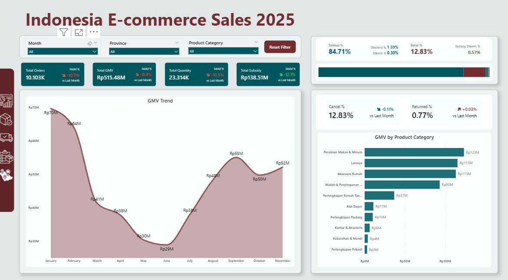

# Indonesia E-Commerce Sales 2025 Analysis
Proyek ini merupakan sebuah `case study` analisis data berdasarkan dataset dari [Kaggle](https://www.kaggle.com/datasets/bakitacos/indonesia-e-commerce-sales-and-shipping-20232025/data). Disini saya mengambil versi `Raw data` dari dataset yang masih **belum melalui proses cleaning** untuk memaksimalkan proses mengasah skill saya dalam berbagai proses analisis data. Disini saya melakukan cleaning data melalui Power Query dari Power BI. Data yang saya gunakan disini hanya data dari periode Desember 2024 – November 2025.

> About Dateset : This dataset contains 24 months of Indonesian e-commerce transactions (Dec 2023 – Nov 2025), including order-level information on product quantities, shipping fees, discounts, payment methods, and delivery destinations. All order IDs are anonymized, and no personal customer data is included. 

All the icon assets used in this project is from [FLATICON](https://www.flaticon.com/)

## 1️⃣ Background

Selama 12 bulan terakhir, sebuah perusahaan e-commerce nasional mengalami pertumbuhan transaksi yang cukup agresif. Perusahaan secara aktif menjalankan strategi:
- Promo diskon (dengan pencatatan diskon yang belum sepenuhnya terstruktur)
- Ekspansi kategori produk
- Perluasan jangkauan logistik ke berbagai provinsi
- Diversifikasi metode pembayaran

Namun, seiring pertumbuhan tersebut, manajemen mulai mempertanyakan:
- Apakah pertumbuhan ini sehat atau hanya didorong subsidi?
- Kategori mana yang benar-benar menjadi penggerak bisnis?
- Apakah terdapat peningkatan risiko pembatalan dan retur?
- Wilayah mana yang perform dengan baik dan mana yang berisiko tinggi?
- Apakah strategi pengiriman sudah efisien?

<strong>Data yang tersedia bersifat transaksional dan mencakup :
</strong>

- Order ID & Order Date
- Product Category
- Status Pesanan & Alasan Pembatalan
- Opsi Pengiriman
- Metode Pembayaran
- Total Pembayaran
- Ongkos Bayar Pembeli
- Perkiraan Ongkir
- Potongan Biaya (Subsidi)
- Total Diskon (nilai ambigu)
- Quantity, Returned Quantity, Net Quantity
- Total Berat (kg)
- Provinsi 

 

`Catatan penting:
Kolom Total Diskon memiliki nilai yang tidak jelas apakah persen atau nominal, sehingga tidak digunakan dalam perhitungan finansial utama, tetapi tetap disimpan untuk eksplorasi data lanjutan.`

## 2️⃣ Assignment

Sebagai Data Analyst di tim Strategy & Business Performance, saya ditugaskan untuk:
- Membangun dashboard analisis performa 12 bulan terakhir yang dapat membantu manajemen memahami:
- Skala pertumbuhan bisnis
- Kualitas transaksi
- Efektivitas subsidi pengiriman
- Performa kategori produk
- Performa geografis

Dashboard ini ditujukan untuk:
- Head of Business
- Director of Operations
- Head of Category
- Growth & Marketing Lead

Fokus utama bukan pada revenue murni platform (karena tidak tersedia data komisi/fee), tetapi pada:
- GMV
- Volume transaksi
- Net quantity terjual
- Tingkat pembatalan
- Tingkat retur
- Eksposur subsidi

## 3️⃣ Goals & Key Questions

### 🎯 Business Goals
1. Mengevaluasi kesehatan pertumbuhan bisnis
2. Mengidentifikasi kategori unggulan dan bermasalah
3. Mengukur dampak subsidi terhadap volume
4. Mengontrol risiko operasional (cancel & return)
5. Mengidentifikasi wilayah dengan risiko tinggi

### ❓ Key Questions to Answer

#### Growth & Scale
1. Apakah GMV dan order tumbuh secara konsisten?
2. Apakah pertumbuhan disertai peningkatan risiko?

#### Product
1. Kategori mana yang menjadi kontributor utama GMV?
2. Kategori mana memiliki return/cancel rate tinggi?

#### Shipping & Subsidy
1. Seberapa besar subsidi yang dikeluarkan?
2. Apakah subsidi sejalan dengan peningkatan order?
3. Apakah berat barang berkorelasi dengan cancel?

#### Order Quality
1. Apa alasan utama pembatalan?
2. Metode pembayaran mana yang memiliki risiko tinggi?

#### Geographic
1. Provinsi mana yang menjadi kontributor utama GMV?
2. Provinsi mana memiliki cancel/return rate di atas rata-rata nasional?